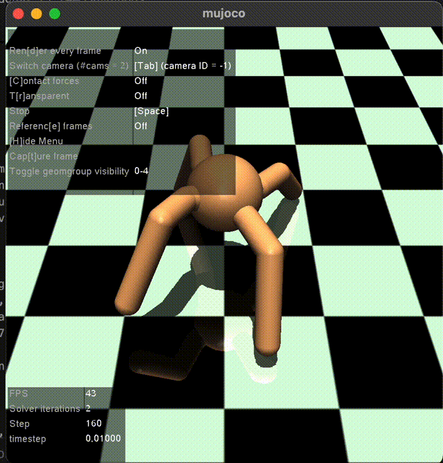

## DEMO


# RL-LOCOMOTION AGENT TRAINING IN MUJOCO
This project trains MuJoCo's simulated ant to walk learning through PPO.

# What does this project do?
It trains MuJoCo in-built ant - 3D quadruped robot to 
walk in simulated environment.From designing custom_wrapper 
to modify reward, to Using, Reinforcement Learning 
model and Proximal Policy Optimization algorithm to train.
The custom reward wrapper adds an additional energy penalty 
(0.1 × joint torques) on top of MuJoCo's default reward.


# Project Structure
- envs/
    --- custom_wrapper.py #reward shaping, obs normalization
- agents/
    --- ppo.py # PPO Implementation
    --- sac.py #SAC alternative
- train/
    --- train.py # main training loop
    --- eval.py # evaluation and rendering
- configs/
    --- ant.yaml #hyperparameters
    --- cheetah.yaml 
- results/ #saved models
- notebooks/ 
    --- plot_results.py 
- requirements.txt
- README.md

## How to Run

**Train:**
**Install dependencies:**
```bash
pip install -r requirements.txt
```
```bash
python -m train.train
```

**Evaluate:**
```bash
python -m train.eval
```

## What i learned
- Training for 100,000 time steps resulted in -1253 total reward i.e. negative , so penalties are dominating . 
- On flipping, the termination is still set to false by default condition.
- During evaluation, understood that RL results can be highly variable and noisy. For the same hyperparameter and training 
settings , different run of same model can produce different results.
- It is important to evaluate trained model across multiple runs to better estimate policy performance rather than depending on 
one single experiment.
- In reward modification, forward velocity was included in the default, so it was counted twice.
- MuJoCo already penalizes energy via ctrl_cost. So, in reward penalty was dominating. Adding the weighted energy penalty improved the results so much.
- After fixing double-counted reward, results improved dramatically:
  - Before fix (100k steps): -1253, -515, -279
  - After fix (1M steps): +2763, +2829, +2753, +2896, +1823

  
## Limitations
- Training is happening in simulation so the training might not work on real hardware. 
- In Simulations even , training steps are expensive on computation.
- RL is noisy , with same settings results can be different. Running same model(trained with 1M timesteps) five times resulted in  rewards (+2763, +2829, +2753, +2896, +1823).
- Fallen penalty never gets added to the modified reward as default condition for termination is never satisfied. (The z-coordinate of the torso (the height) is not in the closed interval given by the healthy_z_range argument (default is [0.2,1.0]))


## References

- Schulman, J., Wolski, F., Dhariwal, P., Radford, A., & Klimov, O. (2017). Proximal Policy Optimization Algorithms. arXiv:1707.06347
- MuJoCo (Todorov et al., 2012)
- Raffin, A., Hill, A., Gleave, A., Kanervisto, A., Ernestus, A., & Dormann, N. (2021). Stable-Baselines3: Reliable Reinforcement Learning Implementations . Journal of Machine Learning Research . (https://jmlr.org/papers/v22/20-1364.html)

